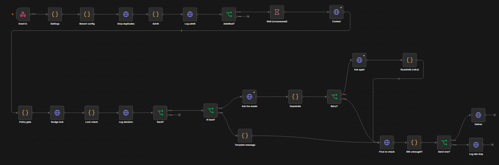
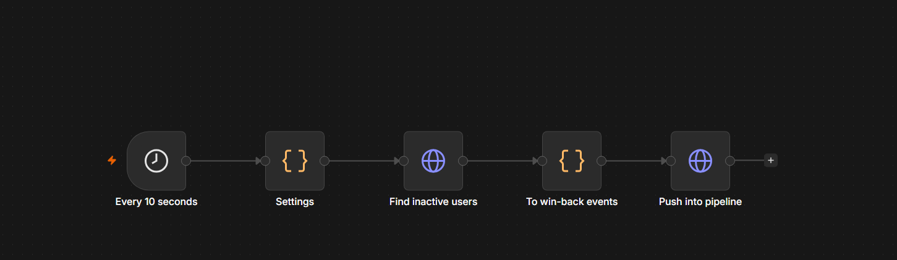
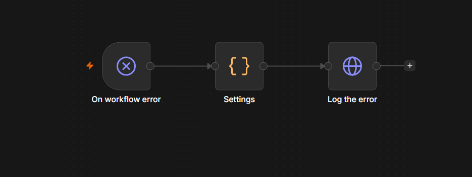

# Hackathon Submission: Yakwetu Re-Engagement Engine

**Team name:** INVONICS
**Team members:** Sydney Kamau (team leader), Larry Williams, Shawn Njenga, Ian Kurui, Derick Rono

**Project name:** Yakwetu Re-Engagement Engine

**Repository (code, workflows, docs):** https://github.com/Kiharal/Invoics_n8n

**n8n workflows** (importable JSON, generated from `tools/build-workflows.js`):
- Pipeline: https://github.com/Kiharal/Invoics_n8n/blob/main/workflows/yak-engine-pipeline.json
- Win-back scan: https://github.com/Kiharal/Invoics_n8n/blob/main/workflows/yak-winback-scan.json
- Error alerts: https://github.com/Kiharal/Invoics_n8n/blob/main/workflows/yak-error-alerts.json

**Demo video:** _<link, viewable by anyone with the link>_

---

## The problem

Yakwetu (www.yakwetu.africa) is a Kenyan pay-once, own-forever film platform. Titles cost KES 5 to 199. We walked the live site as a first-time buyer and found that people drop off for reasons that have nothing to do with the film:

- **Browsing without buying.** People watch a free preview or open a title page and leave. The platform's best selling points (free membership, no subscription, pay once and own it forever, M-Pesa) appear only on /about.
- **Checkout friction.** A payment (M-Pesa, Bonga points, Visa, Mastercard) does not complete. Or the buyer is on an iPhone and only learns after clicking BUY that playback works only in Chrome on Windows, macOS and Android.
- **Sign-up wall.** BUY while signed out lands on a bare sign-in form with no film and no price.
- **Silent churn.** Past buyers stop coming back and nobody reaches out.

Titles are cheap, so each message has to earn its cost, respect consent, and never nag someone who has already bought.

## How the solution works

One event-driven **n8n pipeline** handles every scenario. A scenario ("branch") is just its trigger event plus a small config block: delay, AI or template, message type. Every run goes through the same stages, and **every stage writes a log row with a reason**. That log is the live panel.

```
storefront event -> backend -> n8n webhook
  -> drop duplicates -> wait (compressed) -> reload the viewer fresh from the platform
  -> re-check purchase -> consent -> channel rule -> AI lane or template
  -> guardrails -> final purchase re-check -> deliver -> log
```

### The workflows in n8n

**1. `yak-engine-pipeline`: the shared pipeline every branch runs through.**



1. **Admit the event.** The webhook takes the event in. *Settings* and *Branch config* turn it into a branch with its real delay. *Drop duplicates* and *Admit* ignore repeated event ids. *Log admit* writes the first row.
2. **Wait, then re-check.** *Wait (compressed)* holds the run for the compressed delay. *Context* then reloads the viewer, consent and purchases fresh from the platform.
3. **Decide.** *Policy gate* re-checks the purchase, checks consent, picks the channel and builds the AI brief. *Nudge lock* and *Lock check* allow one nudge per viewer and title. *Log decision* writes why.
4. **Write the message.** *AI lane?* splits the branches:
   - AI branches: *Ask the model*, then *Guardrails*. On a rejection, *Retry?* sends one retry with the reason (*Ask again*, then *Guardrails (retry)*), and after that the fallback template.
   - Payment, device and sign-up branches: *Template message*.
5. **Last check and send.** *Final re-check* and *Still unbought?* catch a purchase made while the message was being prepared. *Deliver* sends; otherwise *Log late stop* records why nothing went out.

**2. `yak-winback-scan`: finds inactive viewers and feeds them into the pipeline.**



Every 10 seconds it asks the platform for viewers idle past the compressed 30-day threshold, then posts a `winback_due` event for each into the same pipeline.

**3. `yak-error-alerts`: the pipeline's error workflow.**



If any pipeline run fails, this writes a `failed` row with the node and the error message, so the failure shows on the live panel.

### Branches

| Branch | Trigger | Real delay (demo) | Message |
|---|---|---|---|
| Browse recovery | preview watched / title opened, no purchase | 2 h (24.5 s) | **AI**: a local LLM (Ollama, qwen2.5:7b) picks one film from up to 5 rule-built candidates and writes a personal message from facts in a brief (story, cast, what the viewer owns and did) |
| Payment rescue | payment did not complete / card declined | 1 min (3.5 s) | Template: nothing was charged, try again or pay another way. No promotion. |
| Unsupported device | BUY on iPhone, non-Chrome desktop, Android without app | 0 | Template: app link, "open in Chrome", or iOS waitlist (counted as demand) |
| Sign-up rescue | left the sign-in page after BUY | 20 min (15.5 s) | Template: joining is free, the film is waiting |
| Win-back | 30 days inactive (scheduled n8n scan) | 30 days (54.5 s) | **AI**: an unowned title matching what they buy |

**Rules the engine enforces (tested; see `docs/stress-test-report.md`):**
- **Never nudge a buyer.** Purchases are checked after the wait and again right before sending.
- **Consent is read fresh after the wait.** Consent withdrawn during the wait is respected. The delivery adapter refuses any channel without consent.
- **Channel is a cost rule, not an AI decision.** Payment and device help goes WhatsApp, then SMS, then email. Marketing goes by email, and by WhatsApp only when the film costs at least KES 149.
- **The AI is boxed in.** It picks only from candidates, via a JSON schema. Guardrails reject urgency or discount language, invented facts and feelings, other titles, links and wrong prices. A rejected message gets one retry, then a personal fallback template goes out with the reason logged. If the model is down, the fallback goes out too.
- **Duplicates are ignored.** 20 identical events at once produce exactly one message.
- **Time compression, not fake timings.** Delays are set in real minutes. One function, `5.1 × ln(1 + minutes)`, turns 1 minute into 3.5 s and 30 days into 54.5 s. Demo mode off gives real timing.
- **Tracking.** Every decision is logged with its reason. Consent changes are recorded as evidence. A purchase made from a nudge link (`nid`) is credited to that nudge with its revenue. `/logs` shows a funnel per branch (runs, held back by reason, sent by channel, purchases, KES) and exports CSV.

## Does it work?

Yes. On the live stack (Docker: n8n 2.40, backend, Ollama on a laptop GPU), 29 Sep 2026:
- All five branches, the purchase re-checks, consent changes, the price floor, duplicates and attribution pass end to end. Email lands in a Mailtrap sandbox.
- **Load:** 400 events in total, including 200 fired at once. 0 lost, 0 workflow errors.
- **Chaos:** the model going down gives a clean fallback. Malformed and hostile input is rejected or escaped.
- Full evidence, known limits and what we'd do for production: `docs/stress-test-report.md`.

## Run it yourself (about 5 minutes, no GPU, no accounts)

```bash
git clone https://github.com/Kiharal/Invoics_n8n.git && cd Invoics_n8n
sh tools/setup.sh        # starts backend + n8n, imports and publishes the workflows
node tools/stress.js     # 24 overlapping scenarios, must end with ALL CHECKS PASSED
```

- Open http://localhost:3000 (storefront simulator and live logs) and http://localhost:5678 (the n8n workflows).
- Without a GPU, the AI lane uses a built-in stub. `sh tools/setup.sh --ai` runs the real model.

## Supporting documents

- `README.md`: how to run, the demo script and runbook.
- `docs/decisions.md`: problem findings from the live site and every design decision (D1–D11).
- `docs/stress-test-report.md`: stress test, chaos and security audit, gaps, and fixes.
- `docs/roadmap.md`: build plan and event contract.
- `docs/growth-engine-design.md`: the longer-term vision.

## What is real and what is simulated

- **Real:** n8n workflows, waits, routing, the local LLM and its guardrails, dedupe, consent and purchase checks, logging, attribution, and email to a Mailtrap sandbox.
- **Simulated:** Yakwetu's platform. The catalog uses real titles, prices and synopses from the live site, and a small backend plays the platform API. WhatsApp is simulated because there is no Meta test number in this build. SMS is logged only, by design.
